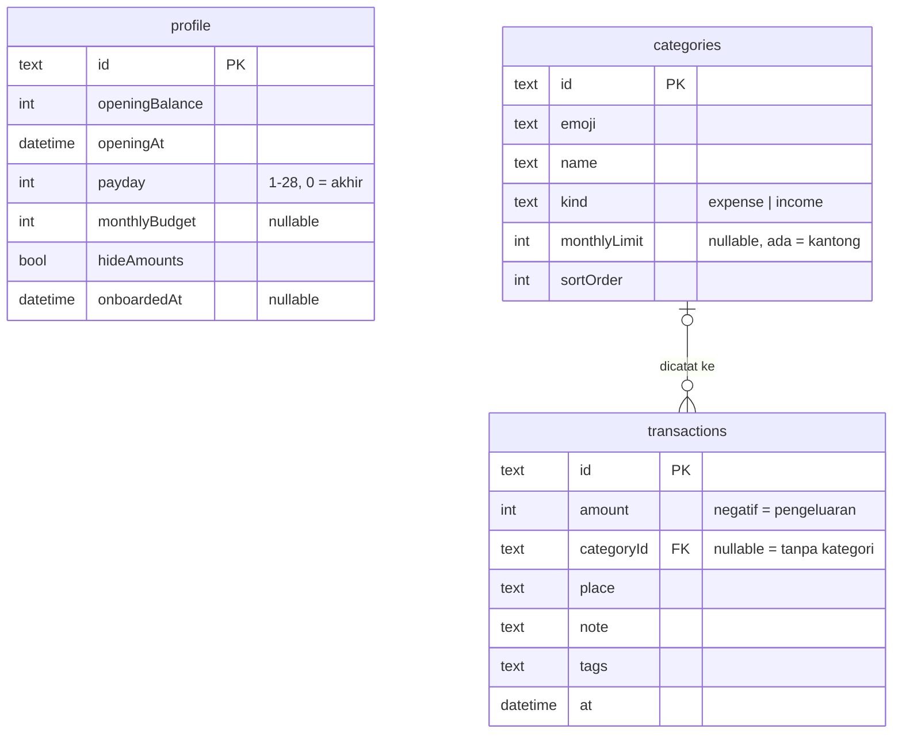

# mibu — rencana MVP

Status: disepakati 2026-10-01. Daftar fitur lengkap ada di [FEATURES.md](FEATURES.md). Nomor screen (02.1, 03.4, …) mengikuti canvas Claude Design.

## Prinsip

- **Full lokal.** Semua data disimpan di HP pakai Drift (SQLite). Belum ada login, belum ada backend.
- **Siap sync.** Skema dibuat supaya nanti bisa ditambah backend tanpa migrasi id.
- **Data turunan nggak disimpan.** Saldo, jumlah kepake, saldo per bulan, dan prediksi selalu dihitung dari transaksi.

## Scope

| Masuk MVP | Ditunda |
|---|---|
| onboarding 01.1 (view udah ada) | login apple/google (01.2), sync, backup cloud |
| atur awal 01.4 + 01.4b, gantiin login | impian, isi ulang, patungan, foto struk |
| beranda 02.1 | transaksi berulang |
| kantong 02.2, tanpa impian dan isi ulang | pengingat harian |
| catat 03.1 + DayStrip / DateSheet / NoteSheet | kunci face id |
| kategori 03.2–03.6 | dark mode (palet gelap belum ada di design) |
| semua transaksi 04.1 | SearchSummary interaktif (drag per hari) |
| struk 04.3 + hapus & undo (04.3b/c) | |
| edit catatan 04.4, tanpa field berulang | |
| statistik 02.3 | |
| cari 04.2, versi simpel | |
| pengaturan 02.4: kategori, kantong, sembunyiin nominal, **ekspor csv** | sisa item pengaturan |

Alur first-run: onboarding 01.1 → atur awal 01.4 → kantong pertama 01.4b → beranda 02.1. Layar login dilewati.

## Skema Drift

Semua id pakai **UUID v4 (text)**. Semua tabel punya `createdAt`, `updatedAt`, dan `deletedAt` (nullable, buat soft delete).

Nama di bawah pakai gaya Dart (camelCase). Di SQLite, Drift otomatis bikin snake_case (default `case_from_dart_to_sql`): `openingBalance` → `opening_balance`, `categoryId` → `category_id`. Backend nanti (Postgres / Supabase) juga pakai snake_case, jadi nama kolomnya sama persis.



`profile` berdiri sendiri, cuma satu baris. Satu kategori bisa punya banyak transaksi. Transaksi boleh tanpa kategori.

```
profile
  id              text  pk          -- satu baris
  openingBalance  int               -- saldo saat atur awal (rupiah)
  openingAt       datetime          -- sejak kapan transaksi dihitung ke saldo
  payday          int               -- 1–28, 0 = akhir bulan
  monthlyBudget   int?              -- budget bulanan (02.4); null = belum diisi
  hideAmounts     bool
  onboardedAt     datetime?

categories
  id              text  pk
  emoji           text
  name            text              -- huruf kecil
  kind            text              -- expense | income
  monthlyLimit    int?              -- null = cuma dicatat; ada nilai = kantong
  sortOrder       int

transactions
  id              text  pk
  amount          int               -- signed: negatif = pengeluaran
  categoryId      text? fk          -- null = tanpa kategori
  place           text              -- "di mana"
  note            text              -- maks 80 karakter
  tags            text              -- maks 3, dipisah koma
  at              datetime          -- waktu lokal
  index (at), index (categoryId)
```

### Turunan (query `watch()`, bukan kolom)

- **Saldo** = `openingBalance` + Σ`amount` transaksi dengan `at ≥ openingAt` dan `deletedAt` null.
- **Kepake per kantong** = Σ pengeluaran kategori itu di bulan berjalan.
- **Saldo per bulan** = saldo kumulatif di akhir tiap bulan.
- **Prediksi bulan depan** = saldo sekarang + rata-rata net 3 bulan terakhir, ditampilkan dengan `±`.
- **"terakhir"** di pilih kategori dan **"pernah kamu tulis"** di NoteSheet = query distinct dari transaksi terbaru.

### Soft delete & undo

- Hapus = isi `deletedAt`. `batalin` = kosongin lagi.
- Hapus kategori: pindahin dulu transaksinya ke kategori tujuan atau ke tanpa kategori, baru soft delete kategorinya. Undo mengembalikan keduanya.
- Baris yang `deletedAt`-nya lebih dari 1 hari dibersihin pas app start.

### Kesiapan sync

Waktu nambah backend nanti:
1. Upload baris yang `updatedAt` > waktu sync terakhir, termasuk yang punya `deletedAt`, biar penghapusan ikut ke-sync.
2. Tambah `userId` di `profile`.

Id nggak perlu diubah.

## Aturan bisnis

### Aman jajan hari ini

```
hariSisa = hari sampai gajian, termasuk hari ini
         = gajian > hariIni ? gajian − hariIni
                            : panjangBulan − hariIni + gajian
           (payday 0 / "akhir" = tanggal terakhir bulan itu)

aman = floor((saldo + pengeluaranHariIni) / hariSisa) − pengeluaranHariIni
```

- Pengeluaran hari ini langsung mengurangi jatah hari ini.
- Pemasukan hari ini langsung menambah jatah, karena udah masuk ke saldo.
- `aman ≤ 0` → chip "kebablasan Rp X hari ini".
- `saldo ≤ 0` → tampil Rp0.
- Contoh: saldo Rp4.530.000, hari ini 16 okt, gajian tanggal 25 → hariSisa = 9 → kira-kira Rp503K.

### Buat apa, limit, kantong **[v2]**

Satu konsep aja: **buat apa** (= baris `categories`). Kantong bukan benda sendiri.

- Pas catat user cuma milih "buat apa?" (03.2). Boleh dilewati: transaksi tanpa kategori tetap sah, kehitung di total kepake/budget, nggak masuk kantong mana pun. Benerinnya lewat 04.4.
- **Limit bulanan** = atribut opsional (`monthlyLimit`), cuma buat pengeluaran. Yang pakai limit jadi toples di tab "kantong".
- "kantong" cuma nama tab + visual toples. Copy pakai "limit": `pasang limit` · `atur limit` · `lepas limit`. Sisa per buat apa = "jatah X".
- `+ pasang limit` (02.2) nggak bikin kategori baru: pilih buat apa yang belum pakai limit, urut paling kepake bulan ini → PocketLimit → simpan. Catatan bulan ini langsung keitung karena kepake dihitung dari transaksi. `bikin kategori baru` ada di bawah sheet.
- Default limit di sheet = maks(Rp300K, ceil(kepake bulan ini × 1,4 ÷ 100K) × 100K).
- `lepas limit` = `monthlyLimit` null, langsung kesimpan + toast `batalin`. Buat apa + catatannya utuh. Beda dari hapus (03.6).
- Gabungin duplikat = 03.6 hapus + pindahin catatan. Nggak ada fitur gabung terpisah.
- Buat apa baru dari 03.2 / 03.3 default tanpa limit; dari 02.2 selalu pakai limit.

### Budget & kantong

- Periode budget = bulan kalender, mulai tanggal 1. Tanggal gajian cuma dipakai buat aman jajan.
- Budget bulanan = `profile.monthlyBudget`, diisi user, bukan turunan. Boleh beda dari Σ `monthlyLimit`. **[diupdate]**
  - Diisi lewat BudgetSheet 00.16 **[perlu design]**, dibuka dari PocketLimit 00.15 + hero 02.2 (M3), kartu 02.4 + ritme budget 02.3 (M6).
  - Kosong → prefill Σ limit kantong dibulatin ke atas per Rp500K. `hapus budget` = balik ke null. Maks 12 digit.
  - Atur awal 01.4 nggak nanya budget; default null.
- Sisa jajan (02.2) = Σ limit − Σ kepake semua kantong bulan ini.
- Persen kepake = round(kepake ÷ limit × 100).
- Status kantong:
  - `hampir abis` kalau persen kepake ≥ 85%
  - `belum kepake` kalau kepake = 0
  - selain itu `aman`
- "kira-kira Rp… sehari" = sisa ÷ sisa hari di bulan ini.

### Limit kantong (PocketLimit 00.15, di 02.2 sheet / 03.4 / 03.5)

```
free = budget − Σ limit kantong lain   (pas edit, kantong ini nggak ikut)
ujung slider = min(budget, max(1jt, ceil(free × 2 ÷ 500K) × 500K))
step = 50K (budget ≤ 5jt) · 100K (≤ 20jt) · 250K (di atasnya)
```

- Garis putus-putus = `free` ("sisa budget Rp…").
- Ketik manual boleh lewat ujung slider (thumb mentok kanan). Batas keras Rp100jt, maks 9 digit.
- Limit > `free` → "lewat Rp…" tebal, tetap boleh disimpan. Selain itu "≈ Rp… sehari" = limit ÷ panjang bulan ini **[diupdate]** (prototype bagi 30).
- `monthlyBudget` null → garis diganti link "pasang budget bulanan" → 00.16 **[perlu design]**, ujung slider Rp2jt.
- Kantong cuma buat kategori pengeluaran; switch disembunyiin buat pemasukan **[diupdate]**.

### Statistik

- Rata-rata dihitung dari periode yang udah lewat aja.
- Ritme budget **[diupdate]** pakai `monthlyBudget` (B) aja, tanpa fallback ke Σ limit: total kepake ngitung semua pengeluaran, termasuk tanpa kategori & non-kantong, jadi Σ limit bukan pembanding yang adil.

```
limit minggu = B × 7 ÷ panjang bulan   (minggu nyebrang bulan: bulan dari hari seninnya)
limit bulan  = B
limit tahun  = B × 12

minggu / bulan:  kepake > limit → lewat budget
                 kepake ≥ 85% limit → hampir abis
                 selain itu → aman
tahun:           kepake > limit → lewat budget
                 persen kepake < persen waktu jalan → di bawah budget
                 selain itu → aman
```

- Periode lalu pakai B yang sekarang (riwayat budget nggak disimpan; tambah tabel riwayat kalau perlu).
- B null → section ritme budget diganti kartu "pasang budget bulanan" **[perlu design]**. Section lain tetap jalan.

### Input

- Nominal cuma angka, tanpa nol di depan. Maks 10 digit di keypad, 12 digit di atur awal.
- Tanggal dan bulan di masa depan nggak bisa dipilih.
- Kategori pemasukan (mis. gajian) cuma muncul pas catat pemasukan.

## Ekspor CSV

- Kolom: `tanggal,jam,jenis,nominal,kategori,emoji,tempat,catatan,tag`.
  - `tanggal` format `yyyy-MM-dd`
  - `jam` format `HH:mm`
  - `jenis` diisi `pengeluaran` atau `pemasukan`
  - `nominal` angka bulat positif tanpa titik
  - `tag` dipisah spasi
- File UTF-8 dengan BOM supaya emoji kebaca di Excel. Escape CSV standar (RFC 4180).
- Yang diekspor: semua transaksi yang `deletedAt`-nya null, urut dari yang terbaru.
- Nama file: `mibu-yyyyMMdd.csv`, dibagikan lewat share sheet.
- Dependency baru: `share_plus`.

## Arsitektur

- Tetap MVVM + Riverpod yang udah ada (`ui/features/*/views` + `view_models`).
- Satu `FinanceRepository` di `data/repositories`. Dipecah kalau udah kegedean.
- Hitungan (aman jajan, statistik, prediksi, CSV) ditulis sebagai fungsi murni di `domain/` dan di-unit test.
- Test repository pakai `NativeDatabase.memory()`.
- Data contoh dari design cuma di-seed saat `kDebugMode`. Seed dihapus kalau atur awal 01.4 udah jadi.
- Skema sekarang (`MonthBalances`, `Pockets.spent`, id autoincrement) diganti total. App belum rilis, jadi `schemaVersion` tetap 1. Hapus data app di device dev.

## Milestone

| # | Isi | Selesai kalau |
|---|---|---|
| M1 | rombak skema + repository + query turunan + test | beranda 02.1 baca dari skema baru |
| M2 | catat 03.1, pilih kategori 03.2, DayStrip, DateSheet, NoteSheet | catat → beranda langsung update. Inti app, udah bisa dipakai sendiri |
| M3 | kantong 02.2 (tanpa isi ulang & impian) + atur / baru / edit / hapus kategori 03.3–03.6 + PocketLimit 00.15 + kolom `monthlyBudget` + BudgetSheet 00.16 (nunggu design) | kantong dan kategori bisa diatur penuh |
| M4 | semua transaksi 04.1, struk 04.3 + hapus & undo, edit 04.4 | catatan bisa dilihat, diubah, dihapus |
| M5 | go_router + first-run (01.1 → 01.4 → 01.4b) | instal baru langsung jalan tanpa seed |
| M6 | statistik 02.3 (ritme budget pakai `monthlyBudget`), pengaturan 02.4 (kartu budget → 00.16), cari 04.2, ekspor CSV | **MVP selesai** |

## Risiko

- **Data hilang saat ganti HP atau uninstall.** Data cuma ada di device. File Drift ada di folder documents app, harusnya ikut iCloud device backup (iOS) dan Auto Backup (Android). Tapi ini **harus dites di device asli** sebelum rilis. Ekspor CSV jadi jaring pengaman.
- **Belum ada impor.** CSV cuma bisa diekspor, belum bisa dipulihkan dari app. Kalau perlu, tambah di pasca-MVP bareng backup & pulihin.

## Pasca-MVP

Login + sync backend, backup & pulihin, pengingat harian, face id, transaksi berulang, impian, patungan, foto struk, dark mode, SearchSummary interaktif.
